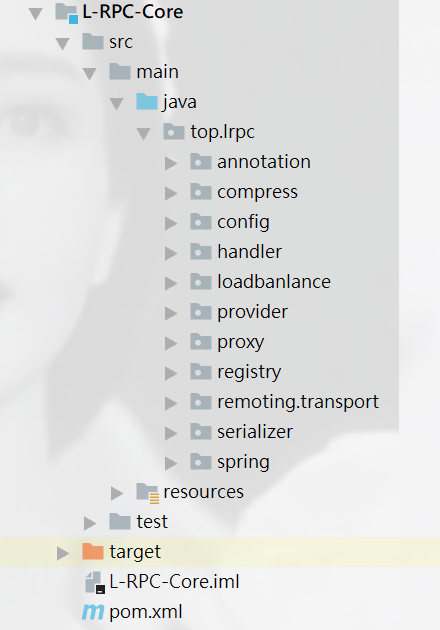

# L-RPC
L-RPC：轻量级远程调用框架

##### 核心代码框架包：

> 

```xml
主要包的功能：
annotation:自定义注解
compress:压缩功能，提供SPI机制
loadbanlance:负载平衡
proxy:动态代理
registry：注册服务
remoting.transport:socket和netty两种方式实现远程调用通信
serializer:序列化
spring:依托spring的自定义注解实现
主要是通过remoting.transport包下面两种socket和netty实现方式，进行辐射全部的代码
```

#### L-RPC框架目前实现的功能：

1.分别使用socket和nio形式的netty框架连接实现通信连接

> socket:使用输入输出流对信息处理，是阻塞模式的，服务端一直等待客户端消息
>
> netty:对NIO封装的框架，使用boss线程组和工作线程组实现通信连接

2.使用zookeeper的CuratorFramework实现服务注册与发现

3.通过@SPI注解以及springboot自动化配置，实现第三方接口代码可插拔实现

> 压缩方式compress
>
> 序列化方式serializer

4.引用参照dubbo的负载均衡策略：一致性哈希算法实现

5.实现ChannelInboundHandlerAdapter下的userEventTriggered方法监听超时事件，实现	心跳检测

> 如果超时，那么客户端就发送标识的心跳包，如果服务端获取心跳包，辨识成功，那么保持连接，但是这种情况只是适合连接少的时候，一旦连接数高了，如果出现超时就发送心跳包，那么发送心跳包这种方式就会增加网络压力。所以可以改成，每隔一段时间客户端发送一个心跳包，服务端识别继续保持连接。

6.动态代理

> 通过动态代理（使用JDK代理模式），我们只需知道接口，无需知道实现的细节，而且实现透明化远程调服务
>
> JDK动态代理：利用反射机制实现代理接口的匿名类，在调用具体方法前调用invokeHandler来处理
>
> CGlib动态代理：利用ASM（开源的Java字节码编辑库，操作字节码）开源包，将代理对象类的class文件加载进来，通过修改其字节码生成子类来处理。


参考：

https://github.com/Snailclimb/guide-rpc-framework
